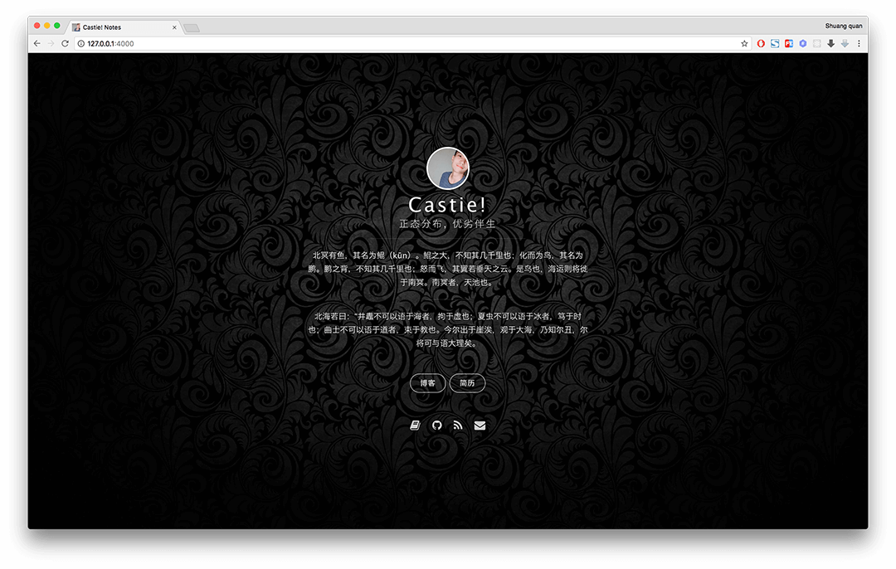

## Focus areas: App 
| Tech-Stack | Repo  | Article |
|:-------:|:-------:|:------:|

## Focus areas: Web 
| Tech-Stack | Repo  | Article |
|:-------:|:-------:|:------:|

## Focus areas: Server 
| Tech-Stack | Repo  | Article |
|:-------:|:-------:|:------:|
