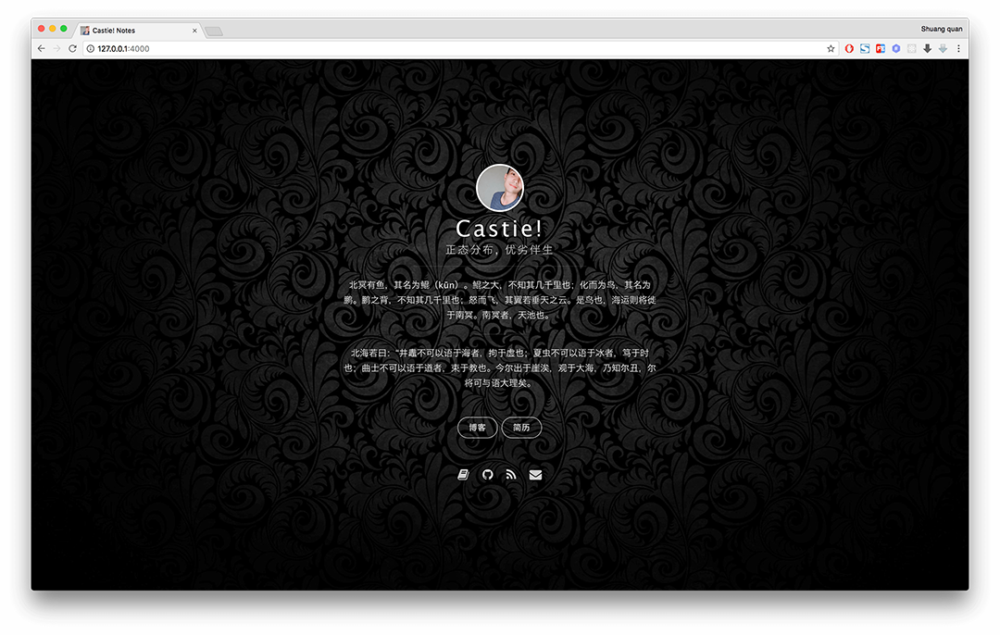

 

#### Latest: [STL 一部数据结构的使用宝典](https://coderzsq.github.io/2018/05/STL-%E4%B8%80%E9%83%A8%E6%95%B0%E6%8D%AE%E7%BB%93%E6%9E%84%E7%9A%84%E4%BD%BF%E7%94%A8%E5%AE%9D%E5%85%B8/)

### Focus areas: App 

| Technology stack |Language| GitHub repositorie  | Article |
|:-------:|:-------:|:------:|:-------:|
|C++|||[C++ 一把窥探OC底层的利刃](https://coderzsq.github.io/2018/03/C++-%E4%B8%80%E6%8A%8A%E7%AA%A5%E6%8E%A2OC%E5%BA%95%E5%B1%82%E7%9A%84%E5%88%A9%E5%88%83/) [C++ 一把剖析OC底层的军刀](https://coderzsq.github.io/2018/03/C++-%E4%B8%80%E6%8A%8A%E5%89%96%E6%9E%90OC%E5%BA%95%E5%B1%82%E7%9A%84%E5%86%9B%E5%88%80/)  [C++ 一把卍解OC底层的斩魄刀](https://coderzsq.github.io/2018/04/C++-%E4%B8%80%E6%8A%8A%E5%8D%8D%E8%A7%A3OC%E5%BA%95%E5%B1%82%E7%9A%84%E6%96%A9%E9%AD%84%E5%88%80/)  [STL 一部数据结构的使用宝典](https://coderzsq.github.io/2018/05/STL-%E4%B8%80%E9%83%A8%E6%95%B0%E6%8D%AE%E7%BB%93%E6%9E%84%E7%9A%84%E4%BD%BF%E7%94%A8%E5%AE%9D%E5%85%B8/)|
|Algorithm||[coderZsq.target.swift](https://github.com/coderZsq/coderZsq.target.swift)|[Swift 数据结构与算法初探](https://coderzsq.github.io/2018/01/Swift-%E6%95%B0%E6%8D%AE%E7%BB%93%E6%9E%84%E4%B8%8E%E7%AE%97%E6%B3%95%E5%88%9D%E6%8E%A2/) [Swift 排序算法的简单取舍](https://coderzsq.github.io/2018/02/Swift-%E6%8E%92%E5%BA%8F%E7%AE%97%E6%B3%95%E7%9A%84%E7%AE%80%E5%8D%95%E5%8F%96%E8%88%8D/) [Swift 第二梯队iOS面试败北感悟](https://coderzsq.github.io/2018/04/Swift-%E7%AC%AC%E4%BA%8C%E6%A2%AF%E9%98%9FiOS%E9%9D%A2%E8%AF%95%E8%B4%A5%E5%8C%97%E6%84%9F%E6%82%9F/)| 
|Router|||[iOS 关于组件化Router设计的争辩](https://coderzsq.github.io/2017/11/iOS-%E5%85%B3%E4%BA%8E%E7%BB%84%E4%BB%B6%E5%8C%96Router%E8%AE%BE%E8%AE%A1%E7%9A%84%E4%BA%89%E8%BE%A9/)|
|HTTP|||[iOS 通俗易懂的HTTP网络](https://coderzsq.github.io/2017/08/iOS-%E9%80%9A%E4%BF%97%E6%98%93%E6%87%82%E7%9A%84HTTP%E7%BD%91%E7%BB%9C/)|
|Design Patterns| |[coderZsq.project.oc](https://github.com/coderZsq/coderZsq.project.oc)|[iOS 执行.py脚本生成解耦架构](https://coderzsq.github.io/2017/05/iOS-%E6%89%A7%E8%A1%8C.py%E8%84%9A%E6%9C%AC%E7%94%9F%E6%88%90%E8%A7%A3%E8%80%A6%E6%9E%B6%E6%9E%84/) [iOS 执行.py脚本生成UI层结构](https://coderzsq.github.io/2017/05/iOS-%E6%89%A7%E8%A1%8C.py%E8%84%9A%E6%9C%AC%E7%94%9F%E6%88%90UI%E5%B1%82%E7%BB%93%E6%9E%84/) [iOS 移动端面向文档开发](https://coderzsq.github.io/2017/07/iOS-%E7%A7%BB%E5%8A%A8%E7%AB%AF%E9%9D%A2%E5%90%91%E6%96%87%E6%A1%A3%E5%BC%80%E5%8F%91/) [iOS 移动端生成工具开发](https://coderzsq.github.io/2017/08/iOS-%E7%A7%BB%E5%8A%A8%E7%AB%AF%E7%94%9F%E6%88%90%E5%B7%A5%E5%85%B7%E5%BC%80%E5%8F%91/) [iOS 移动端架构初探心得](https://coderzsq.github.io/2017/11/iOS-%E7%A7%BB%E5%8A%A8%E7%AB%AF%E6%9E%B6%E6%9E%84%E5%88%9D%E6%8E%A2%E5%BF%83%E5%BE%97/)|
|Core Animation|||[iOS 核心动画的应用及内存泄漏](https://coderzsq.github.io/2017/06/iOS-%E6%A0%B8%E5%BF%83%E5%8A%A8%E7%94%BB%E7%9A%84%E5%BA%94%E7%94%A8%E5%8F%8A%E5%86%85%E5%AD%98%E6%B3%84%E6%BC%8F/)|
| SceneKit |||[SceneKit 不会 Unity3D 的另一种选择](https://coderzsq.github.io/2017/06/SceneKit-%E4%B8%8D%E4%BC%9A-Unity3D-%E7%9A%84%E5%8F%A6%E4%B8%80%E7%A7%8D%E9%80%89%E6%8B%A9/)|
|CoreData|||[CoreData SQL写烦了? 试试亲儿子!](https://coderzsq.github.io/2017/06/CoreData-SQL%E5%86%99%E7%83%A6%E4%BA%86-%E8%AF%95%E8%AF%95%E4%BA%B2%E5%84%BF%E5%AD%90!/)|
|SpriteKit|||[SpriteKit 系统框架中Cocos2d-x的怨念](https://coderzsq.github.io/2017/05/SpriteKit-%E7%B3%BB%E7%BB%9F%E6%A1%86%E6%9E%B6%E4%B8%ADCocos2d-x%E7%9A%84%E6%80%A8%E5%BF%B5/) [SpriteKit 通过检测掩码进行物理识别](https://coderzsq.github.io/2017/05/SpriteKit-%E9%80%9A%E8%BF%87%E6%A3%80%E6%B5%8B%E6%8E%A9%E7%A0%81%E8%BF%9B%E8%A1%8C%E7%89%A9%E7%90%86%E8%AF%86%E5%88%AB/) [SpriteKit 瓦片地图什么的还挺好玩儿](https://coderzsq.github.io/2017/05/SpriteKit-%E7%93%A6%E7%89%87%E5%9C%B0%E5%9B%BE%E4%BB%80%E4%B9%88%E7%9A%84%E8%BF%98%E6%8C%BA%E5%A5%BD%E7%8E%A9%E5%84%BF/)|
|Animations|||[Animations 你真的会用View的动画吗?](https://coderzsq.github.io/2017/04/Animations-%E4%BD%A0%E7%9C%9F%E7%9A%84%E4%BC%9A%E7%94%A8View%E7%9A%84%E5%8A%A8%E7%94%BB%E5%90%97/) [Animations 核心动画什么的要研究透!](https://coderzsq.github.io/2017/04/Animations-%E6%A0%B8%E5%BF%83%E5%8A%A8%E7%94%BB%E4%BB%80%E4%B9%88%E7%9A%84%E8%A6%81%E7%A0%94%E7%A9%B6%E9%80%8F!/) [Animations 自定义转场现已加入豪华午餐](https://coderzsq.github.io/2017/05/Animations-%E8%87%AA%E5%AE%9A%E4%B9%89%E8%BD%AC%E5%9C%BA%E7%8E%B0%E5%B7%B2%E5%8A%A0%E5%85%A5%E8%B1%AA%E5%8D%8E%E5%8D%88%E9%A4%90/) [Animations 快速上手 iOS10 属性动画](https://coderzsq.github.io/2017/05/Animations-%E5%BF%AB%E9%80%9F%E4%B8%8A%E6%89%8B-iOS10-%E5%B1%9E%E6%80%A7%E5%8A%A8%E7%94%BB/)|
|RxSwift|||[RxSwift 大神们都在看的响应式](https://coderzsq.github.io/2017/04/RxSwift-%E5%A4%A7%E7%A5%9E%E4%BB%AC%E9%83%BD%E5%9C%A8%E7%9C%8B%E7%9A%84%E5%93%8D%E5%BA%94%E5%BC%8F/) [RxSwift 函数式过滤运算符实操](https://coderzsq.github.io/2017/04/RxSwift-%E5%87%BD%E6%95%B0%E5%BC%8F%E8%BF%87%E6%BB%A4%E8%BF%90%E7%AE%97%E7%AC%A6%E5%AE%9E%E6%93%8D/) [RxSwift 函数式映射运算符实操](https://coderzsq.github.io/2017/04/RxSwift-%E5%87%BD%E6%95%B0%E5%BC%8F%E6%98%A0%E5%B0%84%E8%BF%90%E7%AE%97%E7%AC%A6%E5%AE%9E%E6%93%8D/) [RxSwift 函数式组合运算符实操](https://coderzsq.github.io/2017/04/RxSwift-%E5%87%BD%E6%95%B0%E5%BC%8F%E7%BB%84%E5%90%88%E8%BF%90%E7%AE%97%E7%AC%A6%E5%AE%9E%E6%93%8D/)|
| Hybird| |[coderZsq.target.swift](https://github.com/coderZsq/coderZsq.target.swift)|[Hybird 搭建零耦合架构从MVC开始](https://coderzsq.github.io/2017/04/Hybird-%E6%90%AD%E5%BB%BA%E9%9B%B6%E8%80%A6%E5%90%88%E6%9E%B6%E6%9E%84%E4%BB%8EMVC%E5%BC%80%E5%A7%8B/) [Hybird 搭建后端Koa.js并过度到MVVM](https://coderzsq.github.io/2017/04/Hybird-%E6%90%AD%E5%BB%BA%E5%90%8E%E7%AB%AFKoa.js%E5%B9%B6%E8%BF%87%E5%BA%A6%E5%88%B0MVVM/) [Hybird 搭建前端Vue.js并升级至MVP](https://coderzsq.github.io/2017/04/Hybird-%E6%90%AD%E5%BB%BA%E5%89%8D%E7%AB%AFVue.js%E5%B9%B6%E5%8D%87%E7%BA%A7%E8%87%B3MVP/) [Hybird 搭建路由Router实现组件化](https://coderzsq.github.io/2017/04/Hybird-%E6%90%AD%E5%BB%BA%E8%B7%AF%E7%94%B1Router%E5%AE%9E%E7%8E%B0%E7%BB%84%E4%BB%B6%E5%8C%96/) [Hybird 搭建客户端实时降级架构](https://coderzsq.github.io/2017/04/Hybird-%E6%90%AD%E5%BB%BA%E5%AE%A2%E6%88%B7%E7%AB%AF%E5%AE%9E%E6%97%B6%E9%99%8D%E7%BA%A7%E6%9E%B6%E6%9E%84/)|
| UIWebView | |[coderZsq.target.swift](https://github.com/coderZsq/coderZsq.target.swift)|[Hybird 说说与Web交互的那些事儿](https://coderzsq.github.io/2017/01/Hybird-%E8%AF%B4%E8%AF%B4%E4%B8%8EWeb%E4%BA%A4%E4%BA%92%E7%9A%84%E9%82%A3%E4%BA%9B%E4%BA%8B%E5%84%BF/)|
|UIKit||[coderZsq.project.oc](https://github.com/coderZsq/coderZsq.project.oc)|[iOS 做好开工前的准备](https://coderzsq.github.io/2016/05/iOS-%E5%81%9A%E5%A5%BD%E5%BC%80%E5%B7%A5%E5%89%8D%E7%9A%84%E5%87%86%E5%A4%87/) [iOS 集成Reveal UI调试利器](https://coderzsq.github.io/2016/05/iOS-%E9%9B%86%E6%88%90Reveal-UI%E8%B0%83%E8%AF%95%E5%88%A9%E5%99%A8/) [iOS 投机流实现 无限轮播图](https://coderzsq.github.io/2016/06/iOS-%E6%8A%95%E6%9C%BA%E6%B5%81%E5%AE%9E%E7%8E%B0-%E6%97%A0%E9%99%90%E8%BD%AE%E6%92%AD%E5%9B%BE/) [iOS 会跳舞的TabbarController](https://coderzsq.github.io/2016/06/iOS-%E4%BC%9A%E8%B7%B3%E8%88%9E%E7%9A%84TabbarController/) [iOS 超Easy实现 渐变导航栏](https://coderzsq.github.io/2016/06/iOS-%E8%B6%85Easy%E5%AE%9E%E7%8E%B0-%E6%B8%90%E5%8F%98%E5%AF%BC%E8%88%AA%E6%A0%8F/) [iOS 狂霸酷炫拽之Button动效](https://coderzsq.github.io/2016/07/iOS-%E7%8B%82%E9%9C%B8%E9%85%B7%E7%82%AB%E6%8B%BD%E4%B9%8BButton%E5%8A%A8%E6%95%88/)  [iOS 5行代码搞定全屏Pop转场](https://coderzsq.github.io/2016/07/iOS-5%E8%A1%8C%E4%BB%A3%E7%A0%81%E6%90%9E%E5%AE%9A%E5%85%A8%E5%B1%8FPop%E8%BD%AC%E5%9C%BA/)

 

### Focus areas: Web 

| Technology stack|Language | GitHub repositorie  | Article |
|:-------:|:-------:|:------:|:------:|
|GitHub Pages||[coderZsq.github.io](https://github.com/coderZsq/coderzsq.github.io)|[Web 将博客迁移至GitHubPages](https://coderzsq.github.io/2017/12/Web-%E5%B0%86%E5%8D%9A%E5%AE%A2%E8%BF%81%E7%A7%BB%E8%87%B3GitHubPages/)|
|React||[coderZsq.webpack.js](https://github.com/coderZsq/coderZsq.webpack.js)|[Web 将项目快速迁移至React](https://coderzsq.github.io/2017/09/Web-%E5%B0%86%E9%A1%B9%E7%9B%AE%E5%BF%AB%E9%80%9F%E8%BF%81%E7%A7%BB%E8%87%B3React/) [Web PC项目快速适配移动端](https://coderzsq.github.io/2017/09/Web-PC%E9%A1%B9%E7%9B%AE%E5%BF%AB%E9%80%9F%E9%80%82%E9%85%8D%E7%A7%BB%E5%8A%A8%E7%AB%AF/) [Web 使用fetch请求后端服务](https://coderzsq.github.io/2017/11/Web-%E4%BD%BF%E7%94%A8fetch%E8%AF%B7%E6%B1%82%E5%90%8E%E7%AB%AF%E6%9C%8D%E5%8A%A1/)|
|Webpack|||[Web 使用webpack构建前端项目](https://coderzsq.github.io/2017/09/Web-%E4%BD%BF%E7%94%A8webpack%E6%9E%84%E5%BB%BA%E5%89%8D%E7%AB%AF%E9%A1%B9%E7%9B%AE/)|
|Gulp|||[Web 使用gulp构建前端项目](https://coderzsq.github.io/2017/09/Web-%E4%BD%BF%E7%94%A8gulp%E6%9E%84%E5%BB%BA%E5%89%8D%E7%AB%AF%E9%A1%B9%E7%9B%AE/)|
|Vue| |[coderZsq.webpack.js](https://github.com/coderZsq/coderZsq.webpack.js)|[Web 是时候用前端写个简历了!](https://coderzsq.github.io/2017/07/Web-%E6%98%AF%E6%97%B6%E5%80%99%E7%94%A8%E5%89%8D%E7%AB%AF%E5%86%99%E4%B8%AA%E7%AE%80%E5%8E%86%E4%BA%86!/) [Web 前端项目要从基本布局开始](https://coderzsq.github.io/2017/07/Web-%E5%89%8D%E7%AB%AF%E9%A1%B9%E7%9B%AE%E8%A6%81%E4%BB%8E%E5%9F%BA%E6%9C%AC%E5%B8%83%E5%B1%80%E5%BC%80%E5%A7%8B/) [Web 简历一定要设计的美美的](https://coderzsq.github.io/2017/07/Web-%E7%AE%80%E5%8E%86%E4%B8%80%E5%AE%9A%E8%A6%81%E8%AE%BE%E8%AE%A1%E7%9A%84%E7%BE%8E%E7%BE%8E%E7%9A%84/) [Web 使用Vue代替陈旧的jQuery](https://coderzsq.github.io/2017/07/Web-%E4%BD%BF%E7%94%A8Vue%E4%BB%A3%E6%9B%BF%E9%99%88%E6%97%A7%E7%9A%84jQuery/) [Web Vue项目速转.htm静态网页](https://coderzsq.github.io/2017/07/Web-Vue%E9%A1%B9%E7%9B%AE%E9%80%9F%E8%BD%AC.htm%E9%9D%99%E6%80%81%E7%BD%91%E9%A1%B5/)|

 

### Focus areas: Server 

| Technology stack|Language | GitHub repositorie  | Article |
|:-------:|:-------:|:------:|:------:|
|Spring||[coderZsq.maven.java](https://github.com/coderZsq/coderZsq.maven.java)|[Server 入门后端你要学什么](https://coderzsq.github.io/2017/11/Server-%E5%85%A5%E9%97%A8%E5%90%8E%E7%AB%AF%E4%BD%A0%E8%A6%81%E5%AD%A6%E4%BB%80%E4%B9%88/) [Server 使用Spring来构建服务](https://coderzsq.github.io/2017/11/Server-%E4%BD%BF%E7%94%A8Spring%E6%9D%A5%E6%9E%84%E5%BB%BA%E6%9C%8D%E5%8A%A1/)|

 

#### Reprint:
本作品由 [Castie!](https://github.com/coderZsq) 创作，采用[知识共享署名 4.0 国际许可协议](https://creativecommons.org/licenses/by/4.0/)进行许可。